# llm-p

Серверное приложение на FastAPI для взаимодействия с языковой моделью через OpenRouter.
Поддерживает регистрацию, JWT-авторизацию и сохранение истории чата в SQLite.

## Установка и запуск

### 1. Установить uv
```bash
pip install uv
```
### 2. Клонировать проект и перейти в папку
```bash
git clone <ссылка-на-репозиторий>
cd llm-p
```
### 3. Создать виртуальное окружение и активировать
```bash
uv venv
source .venv/bin/activate
```

### 4. Установить зависимости
```bash
uv pip install -r requirements.txt
```
### 5. Настроить .env
Создать файл .env в корне проекта по примеру .env.example:

```bash
APP_NAME=llm-p
ENV=local

JWT_SECRET=change_me_super_secret
JWT_ALG=HS256
ACCESS_TOKEN_EXPIRE_MINUTES=60

SQLITE_PATH=./app.db

OPENROUTER_API_KEY=sk-or-v1-ваш-ключ
OPENROUTER_BASE_URL=https://openrouter.ai/api/v1
OPENROUTER_MODEL=inclusionai/ling-2.6-1t:free
OPENROUTER_SITE_URL=https://example.com
OPENROUTER_APP_NAME=llm-fastapi-openrouter
API-ключ можно получить на openrouter.ai.
```
### 6. Запустить сервер
```bash
uv run uvicorn app.main:app --reload --host 0.0.0.0 --port 8000
```
Swagger-документация будет доступна по адресу: http://localhost:8000/docs

## Структура проекта
```bash
app/
├── api/            
├── core/           
├── db/             
├── repositories/   
├── schemas/       
├── services/       
└── usecases/       
```

## Демонстрация работы

### 1. Регистрация пользователя
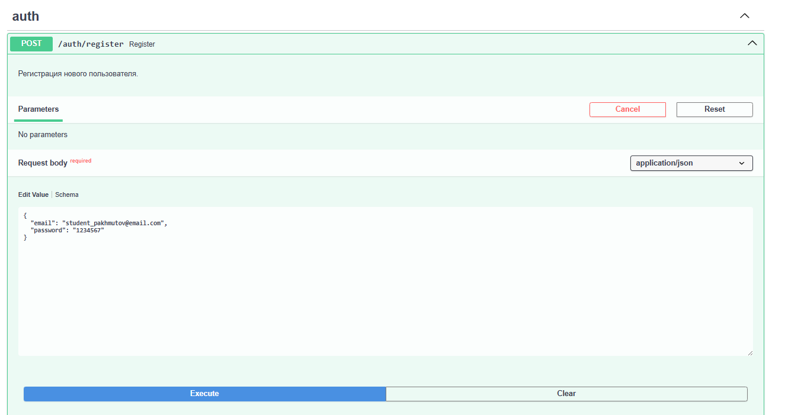
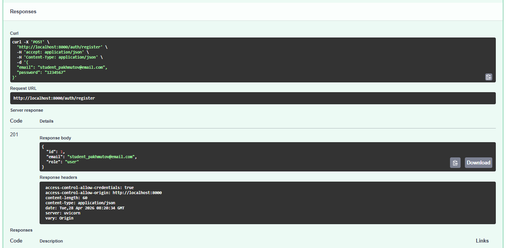
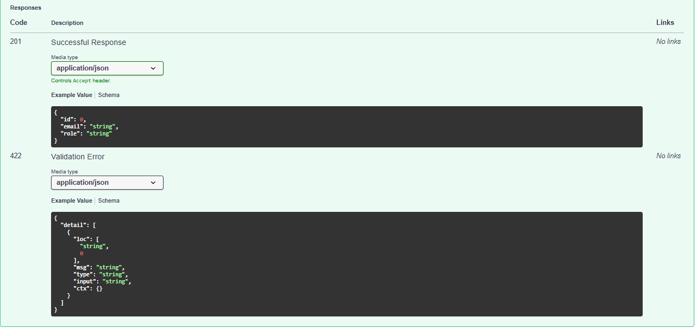

### 2. Логин и получение JWT-токена
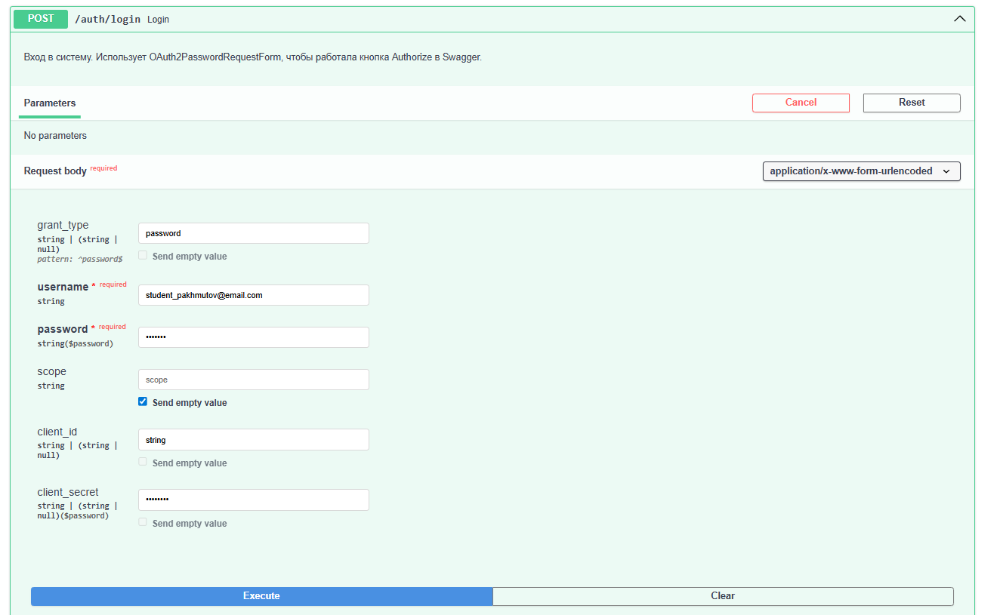
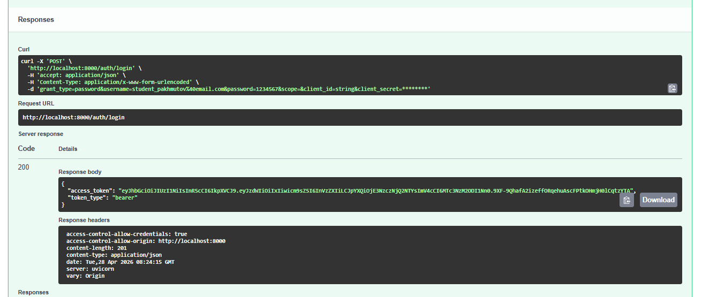
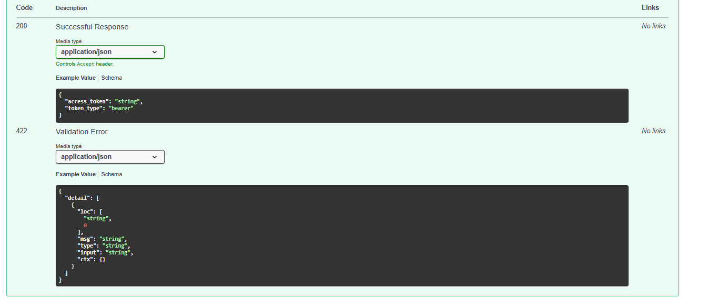

### 3. Авторизация в Swagger
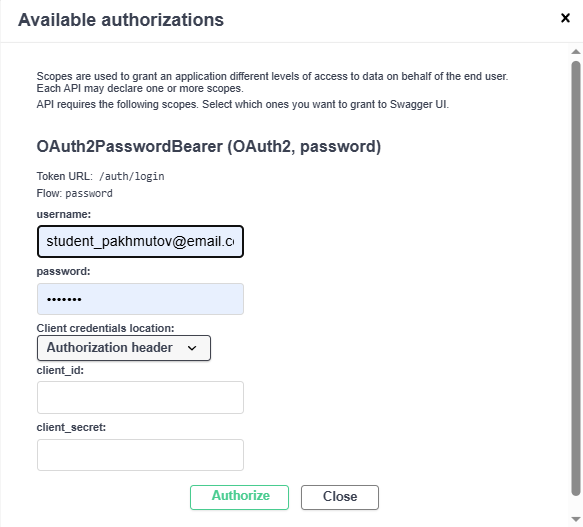
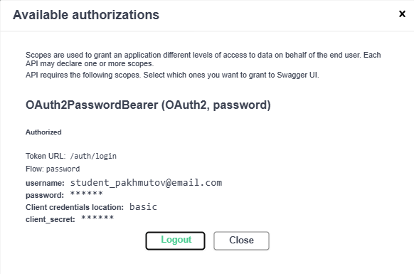

### 4. Запрос к LLM (POST /chat)
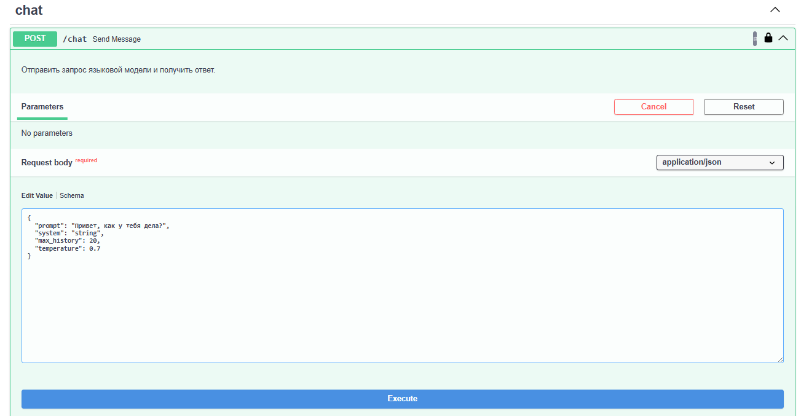
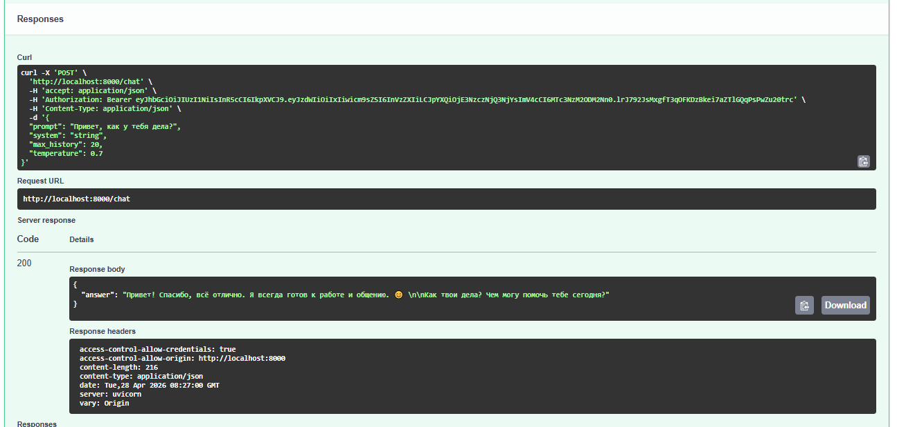
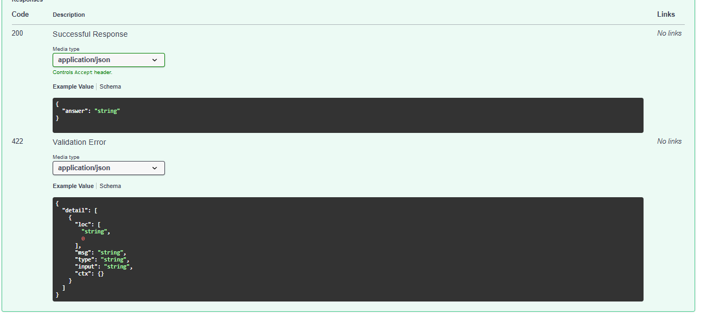

### 5. Получение истории (GET /chat/history)
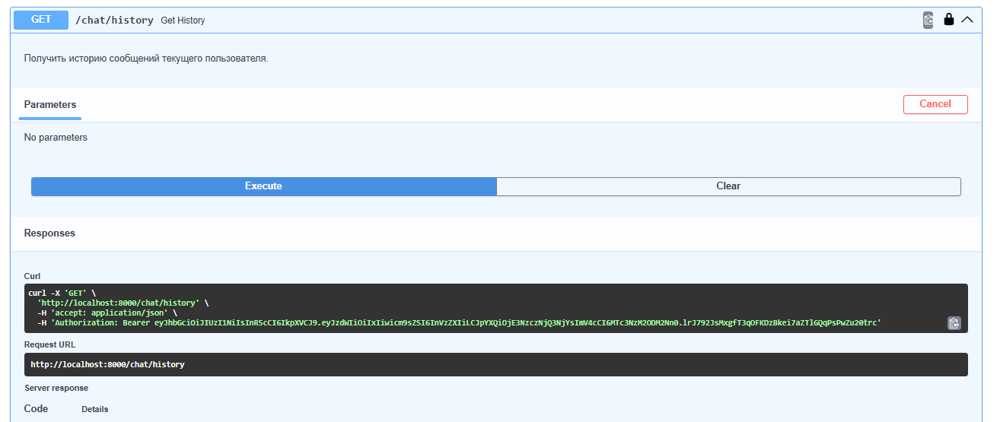
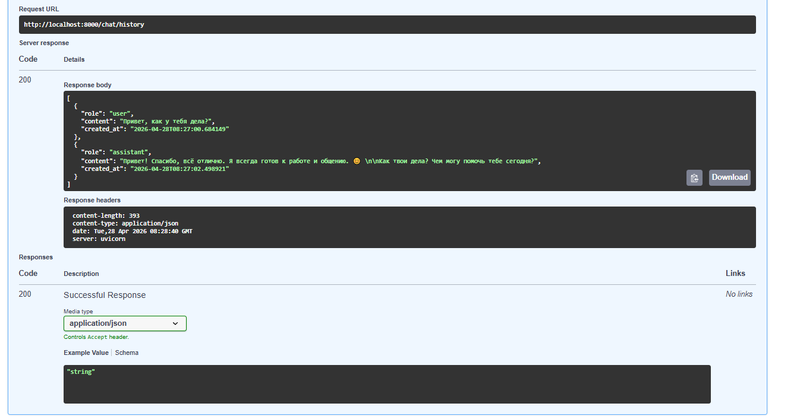

### 6. Удаление истории (DELETE /chat/history)
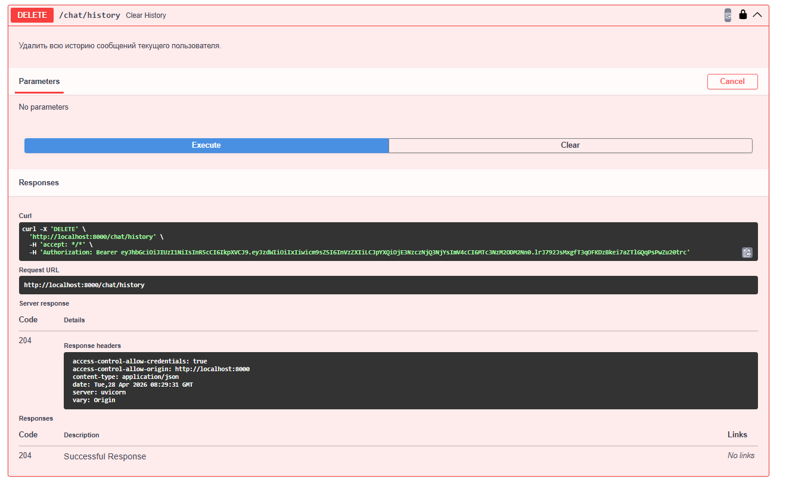